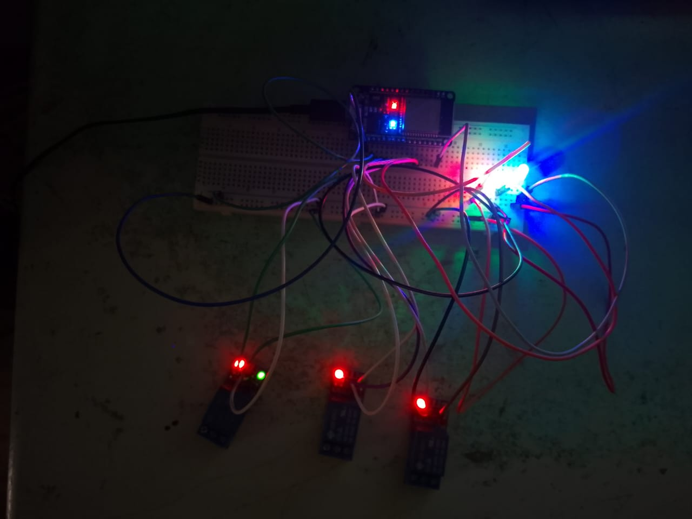

# Arduino Relay Controller

This project is a Wi-Fi connected relay controller using an ESP32 board. It connects to a Firebase Realtime Database and controls 4 relays based on remote commands.

## 📦 Project Overview

- **Microcontroller:** ESP32
- **Relays:** 4-channel
- **Wi-Fi Connectivity**
- **Firebase Realtime Database** for remote relay state management
- **ArduinoJson** for parsing JSON responses

## 📡 Features

- Connects to Wi-Fi and polls a Firebase Realtime Database endpoint.
- Controls 4 relays based on JSON commands received from Firebase.
- Uses 3 onboard indicator LEDs:
  - 🔴 Red: Waiting for Wi-Fi
  - 🔵 Blue: Wi-Fi connected
  - 🟢 Green: Firebase reachable

## 📝 Arduino Code

Main features:
- Connect to Wi-Fi
- Poll Firebase URL
- Parse JSON response with `relay1`, `relay2`, `relay3`, `relay4` states (`ON`/`OFF`)
- Activate relays accordingly

## 📸 Screenshots

## 🔧 Setup

1. Install the **ESP32 board package** in Arduino IDE.
2. Install the **ArduinoJson** library.
3. Replace your Wi-Fi credentials and Firebase URL in the code.
4. Upload the code to your ESP32 board.

## 📖 Dependencies

- [ArduinoJson](https://arduinojson.org/)
- ESP32 board support for Arduino

## 📜 License

MIT License.
